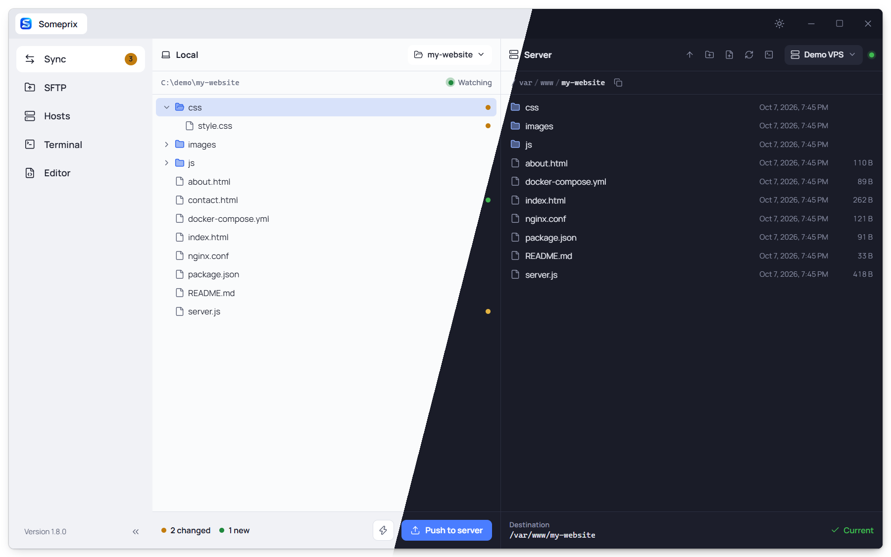
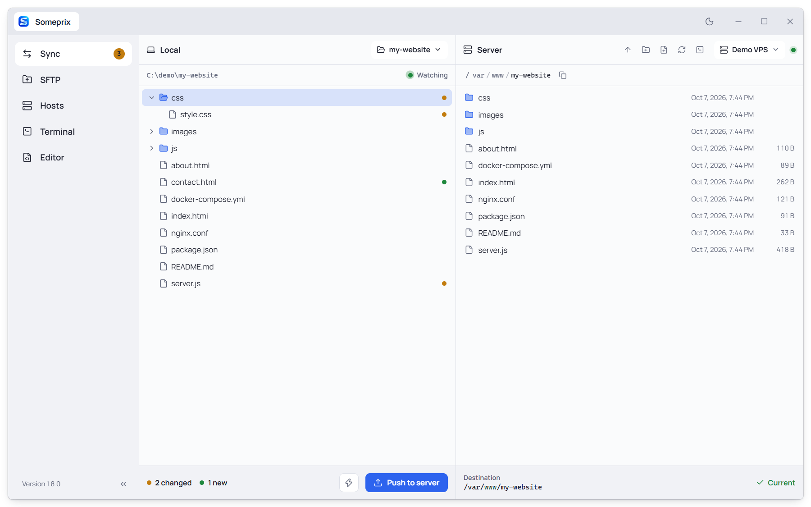
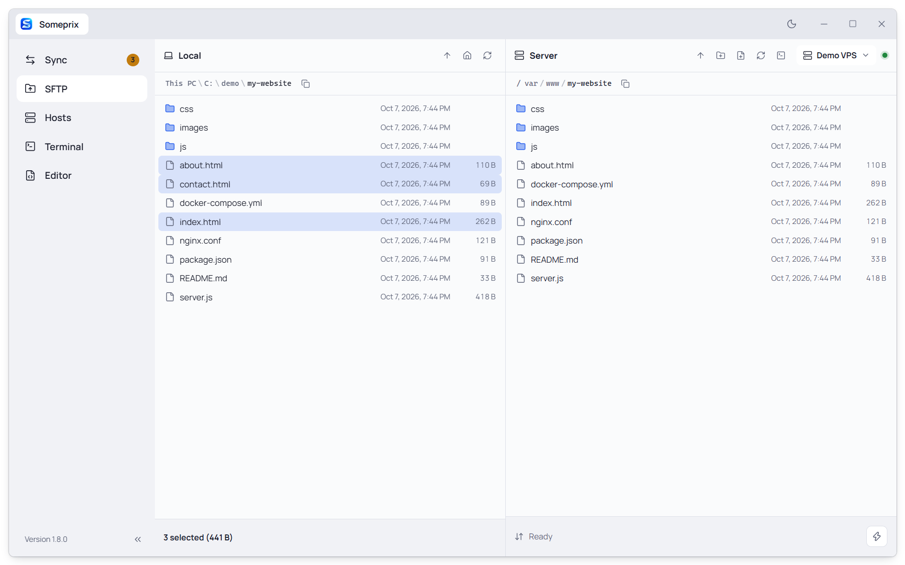
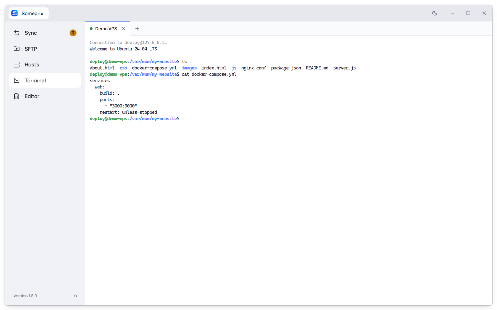
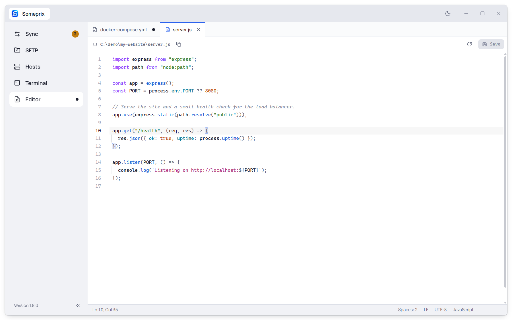

<p align="center">
  
</p>

<h1 align="center">Someprix</h1>

<p align="center">
  <b>A free and lightweight SSH tool for Windows.</b><br />
  Deploy your project, move files, edit code and run commands on your server, all in one fast, modern app.
</p>

<p align="center">
  <a href="../../releases/latest"><b>Download for Windows</b></a>
</p>



<p align="center"><sub>Light and dark themes, one click apart.</sub></p>

## Why Someprix

- **Free.** No account, no subscription, no ads, no tracking. It only talks to your own servers.
- **Lightweight.** The installer is under 4 MB, and the app starts in a moment.
- **Fast.** Transfers run over several connections at once. Fast mode (⚡) packs many files into one compressed archive and unpacks it on the server, so a slow upload line carries far less.
- **All in one place.** Sync, file browser, terminal and code editor share the same saved servers. You log in once.
- **Modern.** A clean interface with dark and light themes, smooth progress bars, live transfer speed and keyboard shortcuts.

## What you get

### Sync: push only what changed

<picture>
  <source media="(prefers-color-scheme: dark)" srcset="docs/screenshots/sync-dark.png" />
  
</picture>

Open your project folder and Someprix watches it. Every file you save, add or delete is marked straight away: amber for changed, green for new, red for deleted. Pick your server and the folder to deploy to once, then press **Push to server** and only those files go up. You can also push a single file or folder from the right-click menu.

### SFTP: drag files both ways

Your computer on the left, the server on the right. Drag files across to upload or download, or use the right-click menu.

- Select many files at once: Ctrl/Shift-click, drag a box, or Ctrl+A. Start typing a name to jump to it.
- Download to your Downloads folder, create files and folders, delete, copy paths.
- **Properties** shows total size, file and folder counts, dates, and server permissions and owner.
- Cancelling a transfer removes what it had already sent.

<picture>
  <source media="(prefers-color-scheme: dark)" srcset="docs/screenshots/sftp-dark.png" />
  
</picture>

### Terminal: click a server, you're in

Click any saved server and a terminal opens already logged in. Open several tabs, use colours, `nano`, `htop` or `vim`, and copy and paste with Ctrl+C / Ctrl+V. If the connection drops, press Enter to reconnect.

<picture>
  <source media="(prefers-color-scheme: dark)" srcset="docs/screenshots/terminal-dark.png" />
  
</picture>

### Editor: change a file and save it back

Double-click a text file, on your computer or on the server, and it opens in the built-in editor. It colours code for 40+ languages (Python, JavaScript, TypeScript, HTML, CSS, JSON, YAML, Dockerfile, nginx, shell, PHP, SQL, Go, Rust and more) and indents as you type.

- **Ctrl+S** saves the file back where it came from, including straight to the server.
- A white dot on the tab means unsaved changes.
- If someone else changed the file in the meantime, Someprix asks before overwriting it.
- Closing a tab or the app with unsaved work asks first.

<picture>
  <source media="(prefers-color-scheme: dark)" srcset="docs/screenshots/editor-dark.png" />
  
</picture>

## Safe with your servers

- Passwords and key passphrases are stored in **Windows Credential Manager**, not in a plain file.
- Each server's identity is checked on every connection. You confirm it the first time, and Someprix warns you if it ever changes.
- Log in with a password or an SSH key.

## Install

1. Download `Someprix_x.y.z_x64-setup.exe` from the [latest release](../../releases/latest).
2. Run it.

Needs Windows 10 or 11 (64-bit).

> The installer isn't code-signed yet, so Windows may show **"Windows protected your PC"**. Click **More info → Run anyway**.

## Keyboard shortcuts

| Where | Keys | Does |
|---|---|---|
| Editor | Ctrl+S | Save |
| Editor | Ctrl+F | Find and replace |
| Editor, Terminal | Ctrl+Tab | Next tab |
| Editor | Ctrl+W | Close tab |
| Terminal | Ctrl+C / Ctrl+V | Copy (with a selection) / paste |
| File lists | Ctrl+A | Select all |
| File lists | Delete | Delete selected |
| File lists | Alt+Enter | Properties |
| File lists | Backspace | Parent folder |

## Build from source

You need [Node.js](https://nodejs.org/) 20+ and [Rust](https://rustup.rs/).

```bash
npm install
npm run tauri dev     # run it in development
npm run tauri build   # build the installer into src-tauri/target/release/bundle/
```

Built with [Tauri 2](https://tauri.app/), React, TypeScript and Rust, with [russh](https://github.com/Eugeny/russh) for SSH, [CodeMirror](https://codemirror.net/) for the editor and [xterm.js](https://xtermjs.org/) for the terminal.
